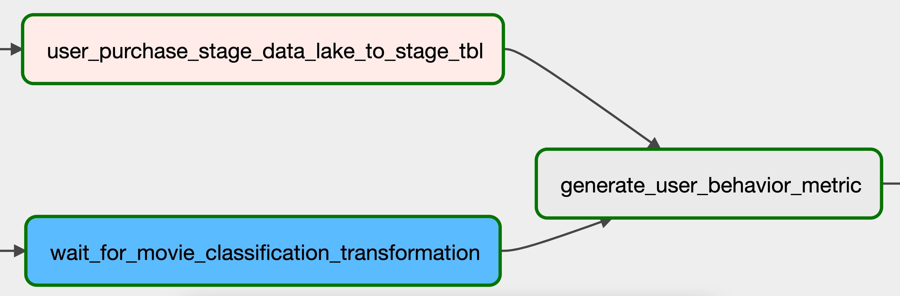

# End to End Batch ETL Processing Project

## Introduction

This project aims to showcase an end-to-end data pipeline for analyzing user behavior using data from user purchases and classified movie reviews. The pipeline involves loading data into a data warehouse, performing transformations to generate user behavior metrics, and evaluating the results.

## Objective

The objective of this project is to demonstrate the implementation of a scalable and cost-effective data pipeline on AWS infrastructure for analyzing user behavior based on their purchases and movie review classifications.

## Design

The design of the data pipeline involves several components:

- Data sources: User purchase data and classified movie review data
- Data warehouse: AWS Redshift
- ETL processes: Extracting data from sources, transforming data, and loading it into Redshift
- Analytics: Generating user behavior metrics
- Infrastructure: Utilizing AWS services for scalability and cost-effectiveness

## Setup

### 4.1 AWS Infrastructure costs

We use:

- 3 m4.xlarge type nodes for our AWS EMR cluster.
- 1 dc2.large for our AWS Redshift cluster.
- 1 iam role to allow Redshift access to S3.
- 1 S3 bucket with about 150MB in size.
- 1 t2.large AWS EC2 instance.
  A very rough estimate would be 358.89 USD per month for our setup. This means our infrastructure will cost approximately about 0.49 USD per hour.

### 4.2 Data lake structure

AWS S3 is used as data lake. Data from external systems will be stored here for further processing. AWS S3 will be used as storage for use with AWS Redshift Spectrum.

- raw: To store raw data. This is denoted as Raw Area.
- stage: This is denoted as Stage Area.
- scripts: This is used to store spark script, for use by AWS EMR.

## Code walkthrough

### 5.1 Loading user purchase data into the data warehouse

To load the user purchase data from Postgres into AWS Redshift we run the following tasks.

- extract_user_purchase_data: Unloads data from Postgres to a local file system in the Postgres container. This filesystem is volume synced between our local Postgres and Airflow containers. This allows Airflow to access this data.
- user_purchase_to_stage_data_lake: Moves the extracted data to data lake’s staging area at stage/user_purchase/{{ ds }}/user_purchase.csv, where ds will be replaced by the run date in YYYY-MM-DD format. This ds will serve as the insert_date partition, defined at table creation.
- user_purchase_stage_data_lake_to_stage_tbl: Runs a Redshift query to make the spectrum.user_purchase_staging table aware of the new date partition.

### 5.2 Loading classified movie review data into the data warehouse

To get the classified movie review data into AWS Redshift, run the following tasks:

- movie_review_to_raw_data_lake: Copies local file data/movie_review.csv to data lake’s raw area.
- spark_script_to_s3: Copies our pyspark script to data lake’s script area. This allows AWS EMR to reference it.
- start_emr_movie_classification_script: Adds the EMR steps defined at dags/scripts/emr/clean_movie_review.json to our EMR cluster. This task adds 3 EMR steps to the cluster, they do the following
  - Moves raw data from S3 to HDFS: Copies data from data lake’s raw area into EMR’s HDFS.
  - Classifies movie reviews: Runs the review classification pyspark script.
  - Moves classified data from HDFS to S3: Copies data from EMR’s HDFS to data lake’s staging area.
- wait_for_movie_classification_transformation: This is a sensor task that waits for the final step (Move classified data from HDFS to S3) to finish.

### 5.3 Generating user behavior metric

Using the combined data from user purchases and classified movie reviews, the generate_user_behavior_metric task populates the user_behavior_metric table in Redshift. Access the Airflow UI at www.localhost:8080 to monitor the DAG's progress. Note that DAG duration may take up to 10 minutes for a complete run.

You can also connect to Metabase running www.localhost:3000 and visualize the data, as shown below.

